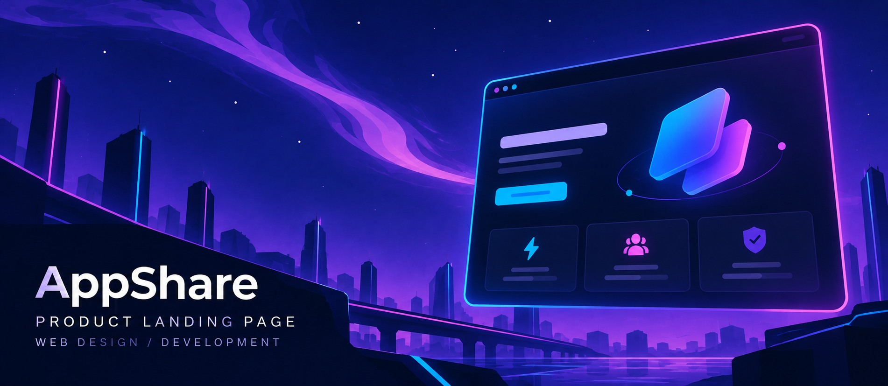
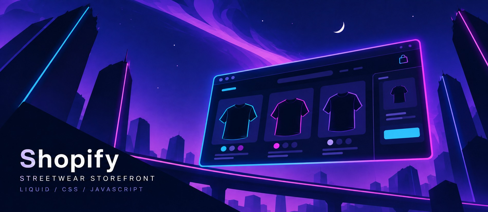
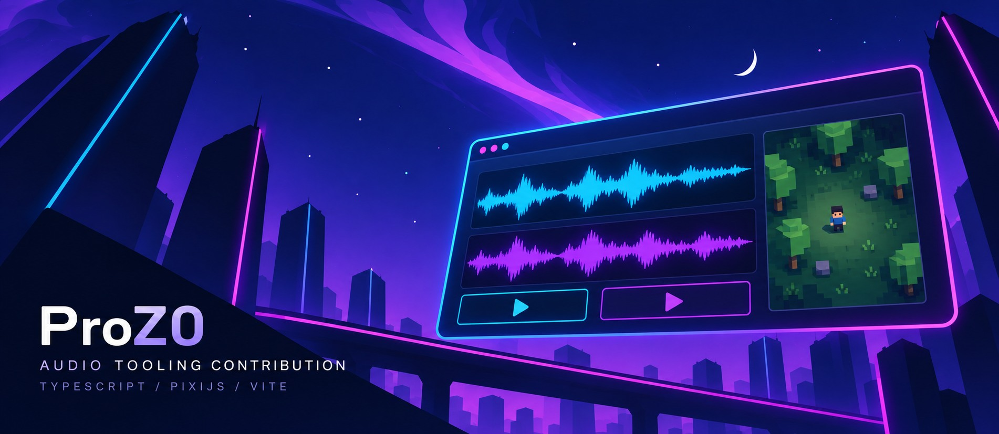

  

<h1 align="center">Good design. Clear purpose. Better websites.</h1>

  Hi, I'm <strong>Tri</strong>, a web developer based in <strong>Ho Chi Minh City, Vietnam</strong>. 
  I build websites for small and medium-sized businesses — to showcase services, 
  connect with customers, and bring online stores to life.

  
  
  

Web development &nbsp; / &nbsp; Web design &nbsp; / &nbsp; Shopify &nbsp; · &nbsp; Rising Talent on Upwork

## Selected work

Product pages, ecommerce, and development tooling — selected projects and contributions.

### 01 / AppShare

**AppShare Product Landing Page Website**  
A product landing page website, featured in my Upwork portfolio.

`Web Design` &nbsp; `Web Development`  
[View my portfolio on Upwork ↗](https://www.upwork.com/freelancers/~011c3300901128f074)

 

### 02 / Shopify Theme Reconstruction

**Shopify Theme Reconstruction · Baseline / Strike styles**  
A Shopify theme implementation for a streetwear storefront, developed through multiple demo and final archive versions. The supplied source includes **58 Liquid section files** and separate Baseline-style and Strike-style homepage templates.

- **Storefront design:** configurable sections, product walls, featured menus, collection carousels, and scrolling announcements.
- **Shopping interactions:** product quick view, variant selection, image gallery, cart drawer, and search drawer.
- **Store pages:** product, collection, cart, blog, article, contact, policy, and customer account templates.
- **Theme customization:** section settings and configurable color schemes.

Implementation details verified from the supplied archives. A public code repository or unrestricted live demo has not been provided.

`Shopify Liquid` &nbsp; `CSS` &nbsp; `JavaScript` &nbsp; `JSON Templates`  
[View my portfolio on Upwork ↗](https://www.upwork.com/freelancers/~011c3300901128f074)

 

### 03 / ProZ0 · Development tooling contribution

A contribution to **ProZ0**, a browser-based pixel-art survival and exploration game. My local work includes an **audio audition harness**, browser tooling fixes, and documentation for audio comparison and review gates.

**Contribution:** development and audio review tooling.  
**Project stack:** TypeScript · PixiJS · Vite · Vitest · Playwright.  
[Explore the project ↗](https://github.com/5erax/ProZ0)

 

Project covers are original illustrations, not screenshots. ProZ0 is presented as a contribution.

## What I can help with

| Your goal | My focus |
| :--- | :--- |
| **Introduce your business** | Websites that present your business and services. |
| **Showcase a product** | Product landing pages and web design. |
| **Start an online store** | Ecommerce websites, Shopify development, and Shopify website design. |
| **Build for the web** | Website and web application development. |

 

## Behind the work

  
  
  
  
  

| Focus | Skills |
| :--- | :--- |
| **Web foundations** | HTML · CSS · JavaScript |
| **Programming** | Python |
| **Ecommerce** | Shopify · Shopify Development · Shopify Website Design |
| **Design & development** | Web Design · Web Development · Web Application |
| **Working together** | Clear communication · Attention to detail |

  
<strong>A little more about me</strong>

 

<ul>
  <li>Based in <strong>Ho Chi Minh City, Vietnam</strong>.</li>
  <li>Focused on websites for <strong>small and medium-sized businesses</strong>.</li>
  <li>My work spans <strong>business websites, product landing pages, and online stores</strong>.</li>
  <li>Find my portfolio and professional profile on <a href="https://www.upwork.com/freelancers/~011c3300901128f074">Upwork</a>.</li>
</ul>

 

  Have a business, a product, or a store to bring online? 
  <strong>Let's talk about your website.</strong>

  

